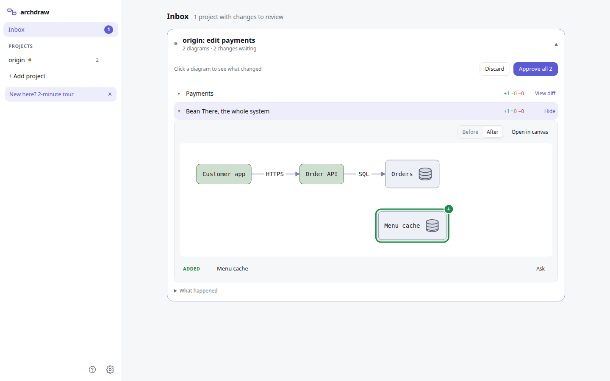

<p align="center">
  
</p>

# archdraw

**Your architecture diagram, as a reviewed file in your repo, that notices when the code drifts.**

archdraw is a free, open-source desktop app for macOS and Linux. It keeps a project's architecture diagrams as plain text files in the repo's `.archdraw/` folder. On the schedule you choose it checks the code, drafts one update when the architecture changed, and shows you a colored diff to approve. Approved updates land in the repo as a pull request or a commit, versioned with the code they describe.

[Download](https://github.com/safiware/archdraw/releases/latest) · [archdraw.dev](https://archdraw.dev) · [User guide](docs/user-guide.md) · [Diagram language](engine/SYNTAX.md)

## Install

| | |
|---|---|
| **macOS 13 or later** (Apple Silicon or Intel) | Download the `.dmg` from [Releases](https://github.com/safiware/archdraw/releases/latest) |
| **Linux** (x64) | The `.deb` (Debian, Ubuntu) or the `.AppImage` from [Releases](https://github.com/safiware/archdraw/releases/latest) |

archdraw uses the machine's own `git`, and the [GitHub CLI](https://cli.github.com) (`gh auth login`) to open and merge pull requests. The app tells you on first run if either is missing. Windows is not supported yet; [say so in an issue](https://github.com/safiware/archdraw/issues) if you want it.

## How it works

1. **Open a repo.** Paste `owner/name` or a GitHub URL, or pick a local folder. Diagrams are text files in `.archdraw/`, so they live in the repo, show up in code review, and need no account with us.
2. **Ask for diagrams.** The built-in agent reads the code and proposes diagrams beside the current ones. Nothing changes until you press Accept. It uses your own AI key: OpenAI, Anthropic, Google or OpenRouter.
3. **Keep them current.** Choose a schedule per project: every hour, once a day, or only when you ask. When `main` moves and the architecture changed, archdraw drafts one update on the `archdraw/update` branch. The Inbox shows it as a colored diff (green added, amber changed, red removed). Approve it, and it merges.
4. **Hand it to your coding agent.** Export writes `ARCHITECTURE.md` plus every diagram as text, ready for Claude Code, Cursor or Codex.

Take the two-minute tour from the first screen (it uses a sample project and needs no key) to see all four.

## What goes where

- archdraw runs on your machine and has no server of its own. When a project is checked, archdraw sends the new commit messages, the names of the files they touch and the diagram outlines to **your** AI provider, to ask whether the architecture changed. When it did, the agent reads the code it needs and drafts the update.
- The agent can only read. It never reads `.env` files, keys, credential folders, Terraform state or anything your `.gitignore` excludes, and it cannot run commands.
- Nothing reaches your repo's `main` until you approve it. Checks run only on the schedule you picked; the default is off.
- Your AI key is kept in the OS keychain (on a Linux desktop without a keyring, in an owner-only file; the app tells you). archdraw has no telemetry and no account.

## The diagram language

Diagrams are written in the [reladraw](https://github.com/reladraw/reladraw) language: you say where things go, and the layout follows.

```
style ours   fill: theme-primary-subtle  border: theme-primary
style store  fill: theme-fill  border: theme-border  badge: database
style dim    text: (color: theme-muted)

node app "Customer app / [dim]iOS + Android[/dim]"  style: ours
node api "Orders API / [dim]Node[/dim]"  right of app (gap: wide)  style: ours
node db "Menu DB"  right of api  style: store
edge app -> api "HTTPS" from: right to: left
edge api -> db "SQL" from: right to: left
```

The full reference is [engine/SYNTAX.md](engine/SYNTAX.md).

## Self-hosting

The same app runs as a server you open in a browser, for example on a home server behind Tailscale. See [docs/self-hosting.md](docs/self-hosting.md).

## Contributing

archdraw is built in the open and contributions are welcome: bug reports, diagram-language improvements, new providers, Windows support. Start with [CONTRIBUTING.md](CONTRIBUTING.md) and the [good first issues](https://github.com/safiware/archdraw/labels/good%20first%20issue). Questions and ideas go in [Discussions](https://github.com/safiware/archdraw/discussions).

If archdraw saves you time, you can [sponsor its development](https://github.com/sponsors/safiware).

## Thanks

archdraw is built on [reladraw](https://github.com/reladraw/reladraw), the diagram language and engine by Joe Walsh. Its central idea is the one archdraw depends on most: you say where things go (`right of app`, `below api`) and the layout follows. That is why an archdraw diagram reads as plainly as text, in a code review, in a diff, or in the context you hand a coding agent, and still draws as a clean picture. The engine in `engine/` is his work, included with its source unmodified. Thank you, Joe, for making it and for sharing it under Apache-2.0.

## License

archdraw is licensed under the [Apache License 2.0](LICENSE). Its diagram engine in `engine/` is [reladraw](https://github.com/reladraw/reladraw) by Joe Walsh, also Apache-2.0; see [NOTICE](NOTICE). "archdraw" is a name of Safiware; see [TRADEMARKS.md](TRADEMARKS.md).
