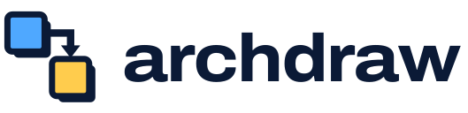
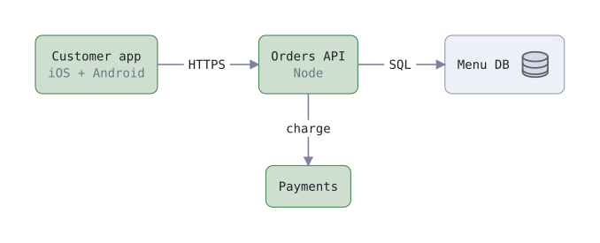

<p align="center">
  <picture>
    <source media="(prefers-color-scheme: dark)" srcset="docs/images/logo-dark.svg">
    <source media="(prefers-color-scheme: light)" srcset="docs/images/logo-light.svg">
    
  </picture>
</p>

<p align="center">
  <b>Architecture diagrams that keep up with your code.</b><br>
  A desktop app for macOS and Linux. Your diagrams live as text in your repo;
  when the code moves, archdraw drafts the update and waits for your OK.
</p>

<p align="center">
  <a href="https://github.com/safiware/archdraw/releases/latest"><b>Download</b></a>
  <span>&nbsp;&nbsp;·&nbsp;&nbsp;</span>
  <a href="https://archdraw.dev">archdraw.dev</a>
  <span>&nbsp;&nbsp;·&nbsp;&nbsp;</span>
  <a href="docs/user-guide.md">User guide</a>
  <span>&nbsp;&nbsp;·&nbsp;&nbsp;</span>
  <a href="engine/SYNTAX.md">Diagram language</a>
</p>

<br>

<p align="center">
  <picture>
    <source media="(prefers-color-scheme: dark)" srcset="docs/images/hero-dark.svg">
    <source media="(prefers-color-scheme: light)" srcset="docs/images/hero-light.svg">
    
  </picture>
</p>
<p align="center"><i>The sample project: three changes land in the code, and archdraw drafts one update to the diagram. One click approves it.</i></p>

<div align="center">

[](LICENSE) [](https://github.com/safiware/archdraw/releases/latest) [](https://github.com/sponsors/asaficontact)

</div>

## What it does

- **Diagrams as text.** Each diagram is a plain file in the repo's `.archdraw/` folder, versioned and reviewed with the code it describes.
- **Checks on your schedule.** Every hour, once a day, or only when you ask. Off until you choose.
- **One update, in color.** When the architecture changed, archdraw drafts a single update and shows it as a diff: green added, amber changed, red removed.
- **Nothing lands until you approve.** An approved update arrives as a pull request or a commit.
- **Made for coding agents.** Export writes `ARCHITECTURE.md` plus every diagram as text, for Claude Code, Cursor or Codex.

## Install

```sh
curl -fsSL https://archdraw.dev/install.sh | sh
```

One command for macOS 13+ (Apple Silicon or Intel) and Linux (x64). It picks the build for your machine from the [latest release](https://github.com/safiware/archdraw/releases/latest), checks it against the release's checksums, and installs it: in Applications on a Mac, where it opens with no extra steps; with apt on Debian and Ubuntu; as an AppImage with an app-menu entry elsewhere. [Read the script](site/public/install.sh) first if you like.

Or download the files yourself:

| | |
|---|---|
| **macOS 13 or later** (Apple Silicon or Intel) | The `.dmg` from [Releases](https://github.com/safiware/archdraw/releases/latest). The first time, macOS asks you to confirm it: [how](docs/install-mac.md) |
| **Linux** (x64) | The `.deb` (Debian, Ubuntu) or the `.AppImage` from [Releases](https://github.com/safiware/archdraw/releases/latest) |

archdraw uses your machine's own `git`, and the [GitHub CLI](https://cli.github.com) (`gh auth login`) to open and merge pull requests. It tells you on first run if either is missing. Windows is not supported yet; [say so in an issue](https://github.com/safiware/archdraw/issues) if you want it.

## First run

Open the app and press **Just try the sample**. The two-minute tour runs on the Bean There project above and needs no AI key.

Then, on your own repo:

1. **Open a repo.** Paste `owner/name` or a GitHub URL, or pick a local folder. archdraw works on its own copy and never touches your working copy.
2. **Ask for diagrams.** The built-in agent reads the code and proposes diagrams; press Accept to keep them. It uses your own key: OpenAI, Anthropic, Google or OpenRouter.
3. **Pick a schedule.** When `main` moves and the architecture changed, archdraw drafts one update on the `archdraw/update` branch. The Inbox shows it as a colored diff. Approve, and it merges.
4. **Export for your coding agent.** `ARCHITECTURE.md` and the diagrams, ready to hand over.

## What a diagram looks like

You say where things go, and the layout follows.

```
style ours   fill: theme-primary-subtle  border: theme-primary
style store  fill: theme-fill  border: theme-border  badge: database
style dim    text: (color: theme-muted)

node app  "Customer app / [dim]iOS + Android[/dim]"  style: ours
node api  "Orders API / [dim]Node[/dim]"  right of app (gap: wide)  style: ours
node db   "Menu DB"   right of api  style: store
node pay  "Payments"  below api     style: ours

edge app -> api "HTTPS"   from: right to: left
edge api -> db  "SQL"     from: right to: left
edge api -> pay "charge"  from: bottom to: top
```

<p align="center">
  <picture>
    <source media="(prefers-color-scheme: dark)" srcset="docs/images/example-dark.svg">
    <source media="(prefers-color-scheme: light)" srcset="docs/images/example-light.svg">
    
  </picture>
</p>

The full reference is [engine/SYNTAX.md](engine/SYNTAX.md).

## What leaves your machine

- archdraw runs on your machine and has no server of its own. When a project is checked, it sends the new commit messages, the names of the files they touch and the diagram outlines to **your** AI provider, to ask whether the architecture changed. When it did, the agent reads the code it needs and drafts the update.
- The agent can only read. It never reads `.env` files, keys, credential folders, Terraform state or anything your `.gitignore` excludes, and it cannot run commands.
- Nothing reaches your repo's `main` until you approve it. Checks run only on the schedule you picked; the default is off.
- Your AI key is encrypted with the OS keychain and stored in an owner-only file. On a Linux desktop without a keyring, the app tells you the key has only basic protection. archdraw has no telemetry and no account.

## Self-hosting

The same app runs as a server you open in a browser, for example on a home server behind Tailscale. See [docs/self-hosting.md](docs/self-hosting.md).

## Contributing

Bug reports, diagram-language improvements, new providers and Windows support are all welcome. Start with [CONTRIBUTING.md](CONTRIBUTING.md) and the [good first issues](https://github.com/safiware/archdraw/labels/good%20first%20issue); sign off each commit (`git commit -s`) to certify the [Developer Certificate of Origin](https://developercertificate.org). Questions and ideas go in [Discussions](https://github.com/safiware/archdraw/discussions).

## Support archdraw

archdraw is built with AI agents, and every feature costs tokens. If it saves you time, [sponsor it on GitHub](https://github.com/sponsors/asaficontact), from $5 a month; sponsorship covers the tokens that build it. Companies can become one of six Cornerstone sponsors, with their logo here and on archdraw.dev.

## Where the language comes from

archdraw's diagram language started from [reladraw](https://github.com/reladraw/reladraw), which inspired it and is its starting engine, included in [`engine/`](engine) under Apache-2.0. Thank you to the reladraw project. From here archdraw grows it into a language made for software architecture: services, data flows, boundaries, deploy paths and how they change.

## License

archdraw is [fair source](https://fair.io). You can use it, read it, change it and run it yourself, for any purpose and at work too; the one thing you can't do is offer a competing commercial product or service built from it. Each release becomes Apache-2.0 two years after it ships. The license is the [Functional Source License, FSL-1.1-ALv2](LICENSE).

The starting engine in [`engine/`](engine) comes from reladraw and stays under the [Apache License 2.0](engine/LICENSE); see [NOTICE](NOTICE). "archdraw" and its logo are trademarks of Tawab Safi; see [TRADEMARKS.md](TRADEMARKS.md).
